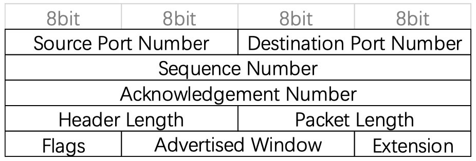

# 接口设计

### 1.TCP 报文的结构定义与报文行为

##### 1.1 报文结构定义:header+data

header结构:



```cpp
typedef struct {
	uint16_t source_port;		//2 bytes 源端口
	uint16_t destination_port;	//2 bytes 目的端口
	uint32_t seq_num; 			//4 bytes sequence number
	uint32_t ack_num; 			//4 bytes ack number
	uint16_t hlen;				//2 bytes 包头长 这个项目里全是20
	uint16_t plen;				//2 bytes 包总长 包括包头和包携带的数据 20+数据长度 注意总长度不能超过MAX_LEN(1400) 防止IP层分片
	uint8_t flags;				//1 byte  标志位 比如 SYN FIN ACK 等
	uint16_t advertised_window; //2 bytes 接收方发送给发送方的建议窗口大小 用于流量控制
    uint8_t ext;				//1 byte  一些额外的数据 在这个项目里是为了将header的大小凑整到20bytes 没有实际意义
} tju_header_t;

// TCP 报文的结构定义
typedef struct {
	tju_header_t header;
	struct timeval sent_time;
	char* data;
} tju_packet_t;
```

##### 1.2 输入header所有字段 和 TCP包数据内容及其长度，构造tju_packet_t，返回其指针

```cpp
tju_packet_t* create_packet(uint16_t src, uint16_t dst, uint32_t seq, 
    uint32_t ack, uint16_t hlen, uint16_t plen, uint8_t flags, 
    uint16_t adv_window, uint8_t ext, char* data, int len){
```

* 与"报文结构"中的参数一一对应，唯独len未解释。len>0，则分配data空间，否则不分配。

##### 1.3 输入header所有字段 和 TCP包数据内容及其长度,构造tju_packet_t,返回其对应的字符串

```cpp
char* create_packet_buf(uint16_t src, uint16_t dst, uint32_t seq, uint32_t ack,
    uint16_t hlen, uint16_t plen, uint8_t flags, uint16_t adv_window, 
    uint8_t ext, char* data, int len)
```

##### 1.4 根据传入的tju_packet_t指针构造并返回对应的字符串

```cpp
char* packet_to_buf(tju_packet_t* p)
```

##### 1.5 清除一个tju_packet_t的内存占用

```cpp
void free_packet(tju_packet_t* pkt)
```

##### 1.6 从一个packet的字符串中根据各个字段的偏移量找到并返回对应的字段

```cpp
uint16_t get_src(char* msg);
uint16_t get_dst(char* msg);
uint32_t get_seq(char* msg);
uint32_t get_ack(char* msg);
uint16_t get_hlen(char* msg);
uint16_t get_plen(char* msg);
uint8_t get_flags(char* msg);
uint16_t get_advertised_window(char* msg);
uint8_t get_ext(char* msg);
```

##### 1.7 传入header所需的各种数据,构造并返回header的字符串

```cpp
char* header_in_char(uint16_t src, uint16_t dst, uint32_t seq, uint32_t ack,
    uint16_t hlen, uint16_t plen, uint8_t flags, uint16_t adv_window, 
    uint8_t ext)
```

### 2.内核活动

##### 2.1 内核收到一份TCP报文时的处理函数

```cpp
void onTCPPocket(char* pkt)
```

* 获取pkt的ip&port->计算hash->是已建立连接的TCP，处理->否则，是已被监听的TCP，处理
* what is TCP based socket?

```cpp
typedef struct {
	int state; // TCP的状态

	tju_sock_addr bind_addr; // 存放bind和listen时该socket绑定的IP和端口
	tju_sock_addr established_local_addr; // 存放建立连接后 本机的 IP和端口
	tju_sock_addr established_remote_addr; // 存放建立连接后 连接对方的 IP和端口

	pthread_mutex_t send_lock; // 发送数据锁
	char* sending_buf; // 发送数据缓存区
	int sending_len; // 发送数据缓存长度

	pthread_mutex_t recv_lock; // 接收数据锁
	char* received_buf; // 接收数据缓存区
	int received_len; // 接收数据缓存长度

	pthread_cond_t wait_cond; // 可以被用来唤醒recv函数调用时等待的线程

	window_t window; // 发送和接受窗口

} tju_tcp_t;

typedef struct {
	sender_window_t* wnd_send;
  	receiver_window_t* wnd_recv;
} window_t;

typedef struct {
	uint32_t ip;
	uint16_t port;
} tju_sock_addr;

// TCP 接受窗口
typedef struct {
	char received[TCP_RECVWN_SIZE];

  received_packet_t* head;
  char buf[TCP_RECVWN_SIZE];
  uint8_t marked[TCP_RECVWN_SIZE];
  uint32_t expect_seq;
} receiver_window_t;

// TCP 发送窗口
typedef struct {
	uint16_t window_size;

  uint32_t base;
  uint32_t nextseq;
  uint32_t estmated_rtt;
  int ack_cnt;
  pthread_mutex_t ack_cnt_lock;
  struct timeval send_time;
  struct timeval timeout;
  uint16_t rwnd; 
  int congestion_status;
  uint16_t cwnd; 
  uint16_t ssthresh; 
} sender_window_t;
```

* socket:a link between to programs running in networks

##### 2.2 以用户填写的TCP报文为参数,根据用户填写的TCP的目的IP和目的端口,向该地址发送数据报

```cpp
void sendToLayer3(char* packet_buf, int packet_len)
```

##### 2.3 仿真接受数据线程 不断调用server或cliet监听在20218端口的UDPsocket的recvfrom 一旦收到了大于TCPheader长度的数据则接受整个TCP包并调用onTCPPocket( )

```cpp
void* receive_thread(void* arg)
```
